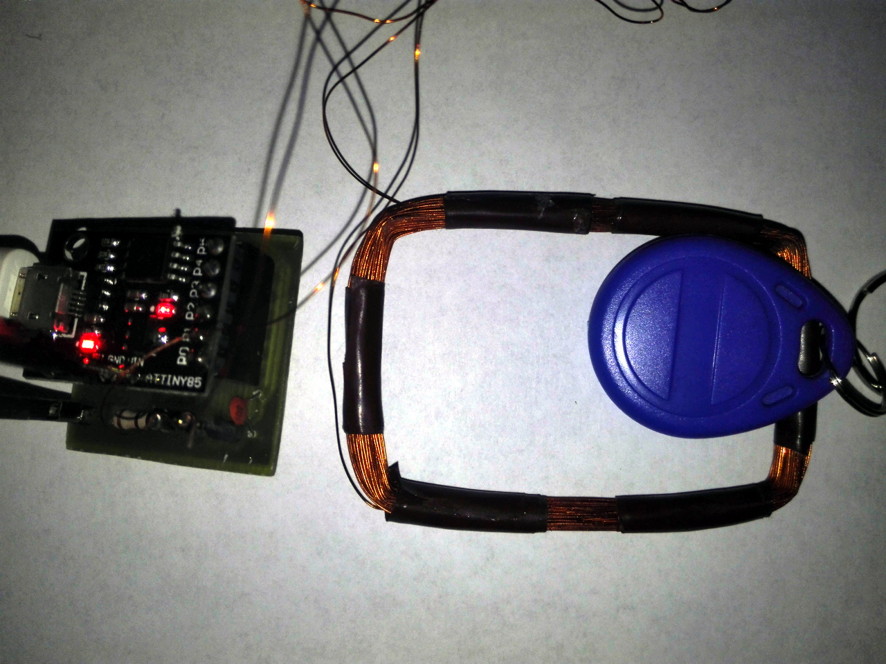

An universal USB 125kHz token reader and programmer.

It uses a small Chinese attiny85 based board (adadfruit clone) and a simple custom shiled containing analog demodulator circuit. The shield is not required, whole circuit could be 
assembled on breadboard, but keep in mind that this solution is much more sensitive to noise and glitches.



Current software supports:
 - reading EM4100 RFID tokens
    - 16, 32, 64 carrier divider (auto detection)
    - Manchaster, Biphase data encoding
 - programming T5557 based RFID tokens
Current software allows to:

The following features are scheduled for future development:
- support for PSK encoding,
- password protection and locking (T5557),
- one-shot command to clone a token.

#### Attiny board preparation.

**!! IMPORTANT !!** Reset pin fuse should be disabled. Please keep in mind that it will disable ISP programming permanently, HV programmer is require to restore default setting.

The chinese PCB has a micronucleus bootloader preinstalled. It is sufficient to upgrade firmware in the attiny trough USB. No other modifications are required. The project has no micronucleus commandline utility included. Manual installation from package repository or source code is required [(link)](https://github.com/micronucleus/micronucleus).

The following command will compile and burn firmware in attiny:

```console
# cd firmware
# make clean all burn
```

#### Host software compilation.

Host software depends on libusb library. It was tested on a linux system (Ubuntu) only.

```console
# cd rfid-tool
# make clean all
```

#### Basic use cases.

```console
---- Reading a EM4100 token

# ./out/rfid-tool -r
New token, carrier divider: 64, modulation: Manchester, customer ID: 75 (0x4b), token: 1469220 (0x166b24)
New token, carrier divider: 64, modulation: Manchester, customer ID: 75 (0x4b), token: 1469220 (0x166b24)

---- Programming a T5557 token

# ./out/rfid-tool -p -b 64 -m manchester -c 0x4b -t 0x166b24


---- Reset to bootloader (firmware upgrade)

# ./out/rfid-tool -R
```
